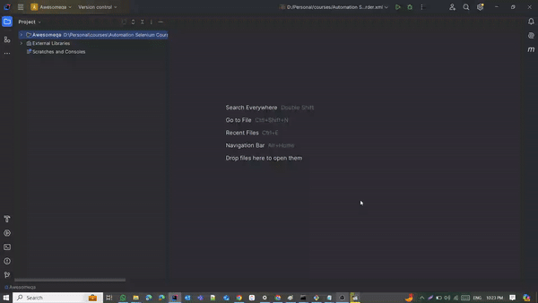

# Awesomeqa

## Table of Contents

- [Introduction](#introduction)
- [Features](#features)
- [Installation](#installation)
- [Usage](#usage)
- [Contributing](#contributing)
- [License](#license)

## Introduction

Awesomeqa is a comprehensive e-commerce platform designed to help users explore and purchase a wide range,Users can browse products, 
compare features, read reviews, and make purchases through a user-friendly interface
 This repository contains the source code for the Awesomeqa application.

## Features

- *Account Management*: Create and manage acounts and profile .
- *Operations *: Perform operatins such as Search for products Add to wishlist , And comparison between products.
- *products purshes *: Add products to cart and make success ordered.
- *Payment methods Security*: Ensure secure and encrypted transactions.

## Installation

To set up the Awesomeqa application locally, follow these steps:

1. Clone the repository:
*   git clone https://github.com/AhmedAbdelkawy-hub/Awesomeqa.git
2. Navigate to the project directory:
*   cd Awesomeqa
3. Install dependencies:
*   npm install
4. Configure the application:

* Update configuration files with necessary settings.
5. Run the application:
*   npm start

## Usage
* User Guide: Refer to the User Guide for detailed information on how to use the Awesomeqa application.

### Local testing execution example

## Contributing
* We welcome contributions from the community. To contribute to Awesomeqa, follow these steps:

## Fork the repository.
* Create a new branch for your feature or bug fix.
* Make your changes and submit a pull request.

## License
* Awesomeqa is licensed under the MIT License.